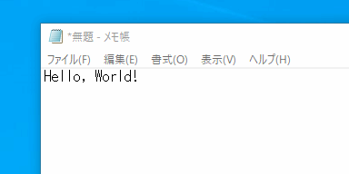

# ClipboardNotifier

Notifies your copied contents to the clipboard on your display.  
JP: クリップボードにコピーした内容をディスプレイ上に表示するアプリです。

This project uses Visual Studio 2022 + WPF + .NET Framework 4.7.2.  
Pre-built binaries for Windows are available in dist directory.  
JP: ビルド済みの Windows 向けバイナリを dist フォルダにおいています。

## License

This project is licensed under the MIT License - see the [LICENSE](LICENSE) file for details.
